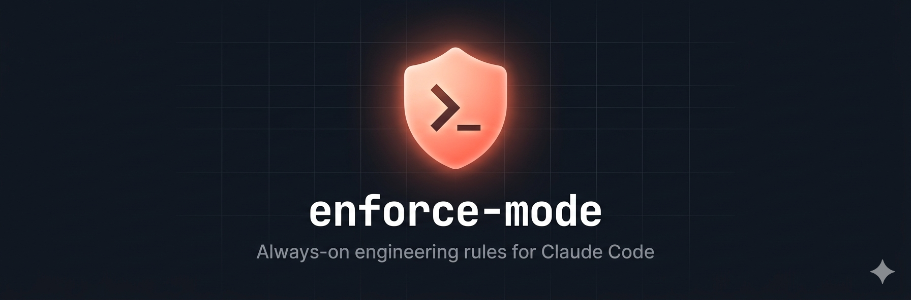
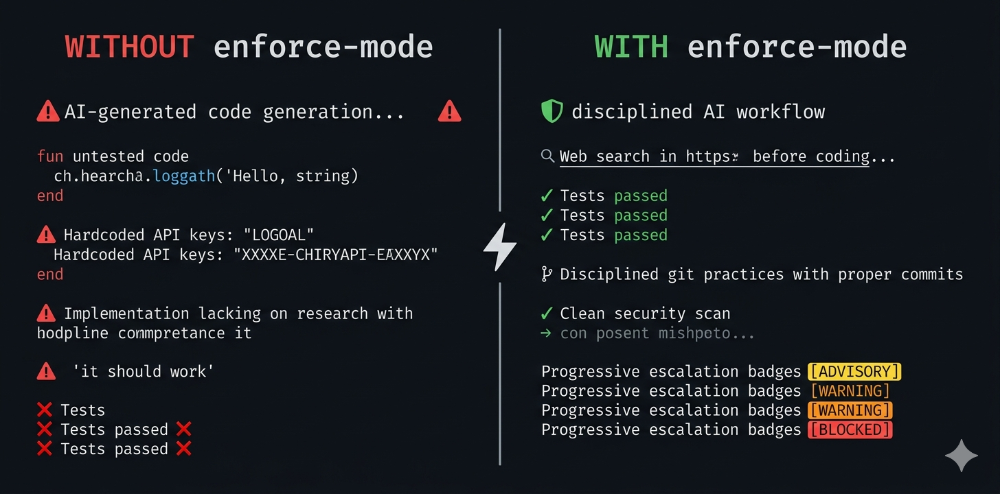
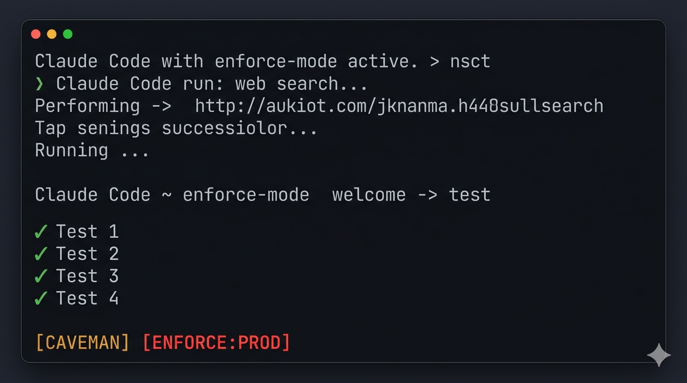
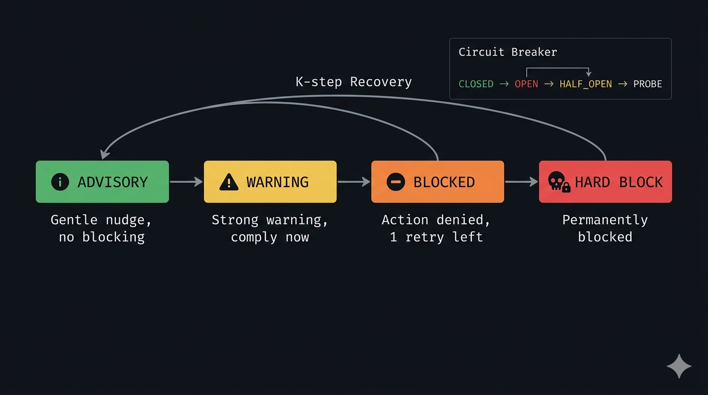
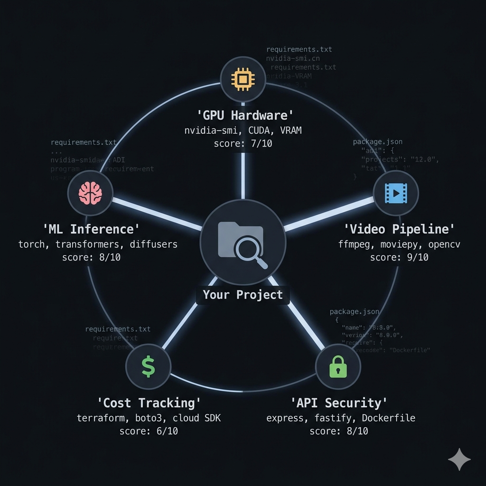

<p align="center">
  
</p>

<p align="center">
  <a href="LICENSE"></a>
  <a href="#testing"></a>
  <a href="#architecture"></a>
  <a href="#installation"></a>
</p>

**Always-on universal engineering rules + project-aware domain rules for [Claude Code](https://docs.anthropic.com/en/docs/claude-code).**

> Think of it as ESLint for AI-assisted engineering — always on, context-aware, graduated enforcement.

enforce-mode injects engineering best practices into every Claude Code session. Universal rules (research-first, git discipline, test-before-ship) are always active. Domain-specific rules for **11 domains** (ML inference, GPU hardware, video pipelines, API security, cost tracking, blockchain, frontend, mobile, research papers, model training, book generation) activate automatically based on what your project contains — detected via weighted signal scoring.

### Without vs. With enforce-mode

<p align="center">
  
</p>

**v6 introduces PECK v2** — Confidence-Weighted Progressive Escalation with context-aware suppression. Builds on v5's circuit breaker and K-step recovery with per-pattern confidence scoring (HIGH/MEDIUM/LOW), contextual suppression (comments/tests/types automatically exempt), and domain-relevance gating. Result: **~60-70% fewer false positives, ~65-75% fewer false negatives** vs v5.

**Zero npm dependencies. Pure Node.js stdlib. < 10ms startup.**

---

## Table of Contents

- [Quick Start](#quick-start)
- [How It Works](#how-it-works)
- [Enforcement Levels](#enforcement-levels)
- [PECK Algorithm](#peck-algorithm)
- [Enforcement Hooks](#enforcement-hooks)
- [Domain Detection](#domain-detection)
- [Configuration](#configuration)
- [Adding Custom Domains](#adding-custom-domains)
- [Architecture](#architecture)
- [Testing](#testing)
- [Token Compression](#token-compression)
- [Comparison with Caveman Mode](#comparison-with-caveman-mode)
- [Inspired By](#inspired-by)
- [Contributing](#contributing)
- [License](#license)

---

## Quick Start

### Install via Claude Code plugin (recommended)

```bash
claude plugin install enforce-mode
```

### Or install standalone

**Unix / macOS:**
```bash
git clone https://github.com/Rutvik552k/enforce-mode.git
cd enforce-mode
bash hooks/install.sh
```

**Windows:**
```powershell
git clone https://github.com/Rutvik552k/enforce-mode.git
cd enforce-mode
powershell -ExecutionPolicy Bypass -File hooks\install.ps1
```

Both installers:
- Copy hooks to `~/.claude/hooks/`
- Wire SessionStart + UserPromptSubmit + PreToolUse + Stop into `~/.claude/settings.json`
- Configure statusline badge
- Are idempotent (safe to re-run)
- Create backup of settings.json before modification

### Switch levels

```
/enforce          # activate with default level (solo)
/enforce solo     # base enforcement
/enforce team     # + parallel execution, cost tracking
/enforce prod     # + full security stack
/enforce off      # disable
```

### Deactivate

```
"stop enforce"    # natural language deactivation
"normal mode"     # natural language deactivation
```

### Statusline badge

<p align="center">
  
</p>

Statusline auto-configures on first activation. Unified script supports multiple mode badges simultaneously (e.g., `[CAVEMAN] [ENFORCE:SOLO]`).

---

## How It Works

```
Claude Code session starts
  |
  v
SessionStart hook fires (enforce-activate.js)
  |
  +-- 1. Resolve level: env var > config file > default ('solo')
  +-- 2. Set per-session level in state file (session isolation)
  +-- 3. Scan cwd: single readdirSync + lazy manifest parsing
  +-- 4. Score domains: weighted signals (deps x3, markers x2, extensions x1)
  +-- 5. Assemble rules: universal + domain (level-filtered, budget-capped)
  +-- 6. Auto-configure statusline badge
  +-- 7. Emit to stdout -> becomes <system-reminder> -> Claude follows rules
```

---

## Enforcement Levels

Three graduated levels control rule strictness:

| Level | What's Enforced | Use Case |
|-------|----------------|----------|
| **solo** | Universal rules + domain WARN rules | Solo dev, prototyping |
| **team** | + session docs, parallel execution, cost tracking, requirements sync | Shared infra, team projects |
| **prod** | + full security stack, DSA efficiency, P99 monitoring, DDoS protection | Production systems |

### Universal Rules (all levels)

| # | Rule | Description |
|---|------|-------------|
| 1 | **Research before code** | Web-search to verify APIs, function signatures, and library versions before implementing |
| 2 | **Git discipline** | Never commit without asking, never push broken code, check for secrets |
| 3 | **Test before ship** | Run tests and show output — "it should work" is not valid |
| 4 | **Pre-completion analysis** | Walk changed code paths, check edge cases, security review |
| 5 | **Web-research mandate** | Verify current docs before implementing external APIs |
| 6 | **Verify before recommend** | Never swap agreed decisions without asking user first |

### Team additions (level >= team)

| # | Rule | Description |
|---|------|-------------|
| 7 | **Session documentation** | Track decisions, models verified, issues found, test results, cost estimates |
| 8 | **Parallel execution** | Long-running tasks must use background subagents; main agent never idles |
| 9 | **Requirements sync** | Keep dependency files in sync with all imports |

### Prod additions (level >= prod)

| # | Rule | Description |
|---|------|-------------|
| 10 | **DSA efficiency** | Big-O analysis, memory budgets, streaming design, P99 tracking |
| 11 | **Full security** | Auth, rate limiting, input validation, file upload protection, prompt injection defense, secrets management, DDoS protection |

---

## PECK Algorithm

**P**rogressive **E**scalation with **C**ircuit-breaker and **K**-step recovery.

The core enforcement engine (v5) that prevents both deadlocks and evasion. Five interlocking mechanisms:

<p align="center">
  
</p>

### Escalation Tiers

Every rule violation is tracked per category. Repeated violations escalate through 4 tiers:

| Tier | Name | Action | Claude Experience |
|------|------|--------|-------------------|
| 0 | Advisory | `approve + additionalContext` | Tool executes, soft guidance injected |
| 1 | Warning | `approve + strong warning` | Tool executes, escalation notice shown |
| 2 | Soft Block | `permissionDecision: "deny"` | Tool blocked, 1 retry before escalation |
| 3 | Hard Block | `exit 2` | Tool permanently blocked, retry loop terminated |

### Category Budgets

Each rule category has a violation budget. When exhausted, tier 3 activates:

| Category | Budget | Escalation Speed |
|----------|--------|-----------------|
| `research` | 4 | Standard — generous for LOW-MEDIUM confidence patterns |
| `dsa` | 3 | Standard |
| `test` | 2 | Faster — 2 violations to hard-block |
| `security-secrets` | 1 | Immediate — HIGH confidence (hardcoded keys) |
| `security-patterns` | 3 | Standard — MEDIUM confidence (eval, CORS) |
| `blockchain` | 3 | Standard — MEDIUM-HIGH for Solidity patterns |
| `frontend` | 4 | Generous — many legitimate exceptions |
| `mobile` | 3 | Standard |
| `research-paper` | 5 | Very generous — LOW confidence, advisory-heavy |
| `training` | 3 | Standard |
| `book` | 5 | Very generous — LOW confidence |

### PECK v2: Confidence-Weighted Evaluation

Each pattern declares a confidence level that determines its effective weight:

```
effectiveWeight = patternConfidence × contextMultiplier × domainRelevance
```

| Confidence | Value | When to Use | Effect |
|-----------|-------|-------------|--------|
| **HIGH** | 1.0 | Structural prefix/suffix eliminates ambiguity | Accelerated escalation (skip tier 0) |
| **MEDIUM** | 0.5 | Usually wrong but has legitimate uses | Standard escalation |
| **LOW** | 0.25 | Absence detection, high context dependence | Advisory only (never escalates) |

**Context multipliers** suppress false positives automatically:

| Context | Multiplier | Example |
|---------|-----------|---------|
| Inside comment | 0.0 | `// eval() is dangerous` — suppressed |
| Inside test file | 0.0 | Test code intentionally has violations |
| Inside type/interface | 0.0 | Type annotations aren't runtime |
| Normal code | 1.0 | Full weight |
| Security-sensitive file | 1.5 | Extra scrutiny on auth.js |

LOW confidence patterns **cannot** open the circuit breaker or escalate beyond tier 0.

### Semantic Fingerprinting

Actions are fingerprinted by `category:filePath`, not exact content. This catches retry variants — Claude changing variable names or comments but making the same violation.

**Exact retry detection**: If the same fingerprint appears within 30 seconds, the violation is double-counted. An exact retry reaches hard-block in 2 calls instead of 3.

### Circuit Breaker

Per-category circuit breaker (adapted from [Hystrix](https://github.com/Netflix/Hystrix) for LLM agents):

```
CLOSED ──(3 failures)──> OPEN ──(2 intervening calls)──> HALF_OPEN ──(probe)──> CLOSED
                           |                                  |
                           |                                  +──(fail)──> OPEN
                           +── All same-category actions → tier 3
```

When a circuit opens, ALL actions in that category are hard-blocked regardless of individual violation count. The circuit probes half-open after Claude makes 2 non-violating tool calls (indicating changed approach).

### K-Step Recovery

On violation, a recovery window of K=5 tool calls starts. Claude has 5 tool calls to comply (e.g., WebSearch, add complexity comment). If the window expires without compliance, violations auto-escalate.

### Forgiveness Decay

When Claude complies (performs research, runs tests, adds complexity comments), violation count decays by 1 and the circuit breaker resets. Good behavior is rewarded.

### Dead Letter Queue

Actions that reach tier 3 (hard-block) are recorded in a dead letter queue. Phase 2 (stop-guard) surfaces all dead letters as unresolved compliance failures at session end.

### Why PECK Prevents Both Problems

| Problem | How PECK Solves It |
|---------|--------------------|
| **Deadlock** (infinite deny loop) | Tier 2 bounded — max 1 retry before tier 3 hard-block terminates loop |
| **Evasion** (ignoring warnings) | Tier 0→1→2 — warnings escalate, then deny, then permanent block |
| **Exact retries** | Fingerprint detects, double-counts toward escalation |
| **Category-wide loops** | Circuit breaker opens after 3 failures — all same-category hard-blocked |
| **Context compression forgetting** | K-step tracker re-injects every tool call |
| **Regression after compliance** | Forgiveness decay only reduces by 1, not full reset |

### Research Sources

PECK synthesizes techniques from:

- [AgentSpec](https://arxiv.org/abs/2503.18666) — `llm_self_examine` tiered enforcement
- [Agent Behavioral Contracts](https://arxiv.org/html/2602.22302v1) — recovery windows, probabilistic satisfaction
- [Guardrails AI](https://www.guardrailsai.com) — `FIX_REASK` pattern, bounded `num_reasks`
- [Causality Laundering (ARM)](https://arxiv.org/abs/2604.04035) — denial-feedback leakage awareness
- [Instruction Hierarchy](https://arxiv.org/html/2404.13208v1) — system-level framing for warnings
- Circuit breaker pattern (Fowler/Hystrix) — adapted for intervening-call-based reset

---

## Enforcement Hooks

7 hooks using a two-phase architecture with PECK v2. All <10ms. Per-session isolation.

### Phase 1 — PreToolUse (per tool call)

| Hook | Triggers On | Gate |
|------|-------------|------|
| `enforce-write-guard.js` | Write, Edit, NotebookEdit | Secrets: exit 2. Research + security: PECK escalation |
| `enforce-dsa-guard.js` | Write, Edit, NotebookEdit | DSA complexity: PECK escalation. Cross-hook coordination with write-guard |
| `enforce-domain-guard.js` | Write, Edit, NotebookEdit | 6 new domains: PECK v2 confidence-weighted (30 patterns) |
| `enforce-bash-guard.js` | Bash | Git secrets/inference/sleep-poll: exit 2. Test gate: PECK escalation. Cost: soft warn |

### Phase 2 — Stop (at response end)

| Hook | What It Checks |
|------|---------------|
| `enforce-stop-guard.js` | Unresolved research/DSA, stale tests, missing requirements, PECK dead letters, escalation summary, circuit breaker status |

### What Gets HARD BLOCKED (exit 2, always)

These bypass PECK — immediate hard block regardless of tier:

| Action | Why |
|--------|-----|
| Hardcoded secrets (AWS keys, GitHub PATs, Stripe, private keys, DB URIs, JWTs) | Security — never allow |
| `git add .env` (exact match) or `git add .` | Catch-all staging may include secrets |
| `python train.py` in foreground | Must use `run_in_background=true` |
| `torchrun` / `accelerate launch` in foreground | Must use background |
| `sleep 60 && cat` (poll pattern, >=30s) | Use `run_in_background` instead |

### What Uses PECK Escalation (tier 0→3)

| Violation | Category | Budget | Tier 0 Message |
|-----------|----------|--------|----------------|
| External imports without web research | `research` | 3 | "WebSearch for library docs before relying on training knowledge" |
| Algorithmic code without complexity justification | `dsa` | 3 | "Add complexity comment or WebSearch for optimal approach" |
| `git commit` without tests in transcript | `test` | 2 | "Run tests first" |
| Security anti-patterns (eval, SQL concat, CORS *) | `security` | 1 | "Security anti-pattern detected" |

### Deadlock Prevention (10 original fixes + PECK)

| Fix | What Changed |
|-----|-------------|
| Inference regex | Anchored to `python *.py` filenames — string literals don't trigger |
| Git commit + no transcript | Soft warn fallback — not hard block |
| Secret file matching | Exact basename — `.env-display.tsx` no longer blocked |
| Heroku regex | Requires `HEROKU_API_KEY=` context — bare UUIDs pass |
| Empty transcript | Soft warn — prevents infinite deny loop |
| `readFileSync` | Only flagged inside loops — standalone config reads pass |
| `Promise.all()` | Narrowed to ORM patterns — `Promise.all()` passes |
| Small lists | `if x in [1,2,3]` passes — only 10+ elements flagged |
| Cross-hook ping-pong | DSA guard defers when write-guard already flagged same file |
| Self-exemption | Hook files + test files skip research/DSA checks |
| **PECK bounded deny** | Tier 2 deny max 1 retry before tier 3 hard-block |
| **PECK circuit breaker** | Opens after 3 failures — prevents category-wide loops |
| **PECK exact retry** | Double-counts same fingerprint within 30s |

### Per-Session Isolation

Each session has its own PECK state stored in `/tmp/enforce-{session_id}.json`:

```
Session A: /enforce solo   → enforces at solo level, own PECK state
Session B: /enforce off    → all hooks skip — no enforcement
Session C: (default)       → enforces at config default level, own PECK state
```

Turning enforce off in one session does **not** affect other sessions. The global flag (`~/.claude/.enforce-active`) is only used for the statusline badge.

---

## Domain Detection

Domains activate via **weighted signal scoring**. Each signal type has a weight; when cumulative score meets the threshold, the domain turns on.

<p align="center">
  
</p>

### Supported Domains (11)

#### Original Domains (v1)

| Domain | Key Signals (weight) | Threshold | What It Enforces |
|--------|---------------------|-----------|------------------|
| **ml-inference** | torch (3), transformers (3), diffusers (2), .safetensors (2), models/ (1) | 4 | Background inference, architecture-first, verify weights, pipeline docs |
| **gpu-hardware** | cupy (3), triton (3), flash-attn (3), .cu files (3), cuda/ (2) | 4 | VRAM math, multi-GPU verification, OOM prevention, cost per operation |
| **video-pipeline** | ffmpeg-python (3), moviepy (3), opencv-python (2), decord (3), renders/ (2) | 4 | Parallel execution, streaming-first, codec awareness, resource limits |
| **api-security** | fastapi (2), express (2), django (2), Dockerfile (2), k8s/ (2) | 3 | Auth on endpoints, rate limiting, input validation, prompt injection defense |
| **cost-tracking** | boto3 (2), google-cloud (2), terraform/ (3), .tf files (2) | 3 | Cost reporting, budget guards, instance awareness, egress costs |

#### New Domains (v2 — PECK v2 confidence-weighted)

| Domain | Key Signals (weight) | Threshold | What It Enforces |
|--------|---------------------|-----------|------------------|
| **blockchain** | hardhat (3), @openzeppelin (3), .sol (3), foundry.toml (3) | 3 | CEI pattern, reentrancy guards, gas bounds, access control, upgrade safety |
| **frontend** | react (2), next (3), .tsx/.jsx (2), next.config.js (2), components/ (2) | 2 | XSS prevention, key props, a11y, effect deps, SSR hydration, auth tokens |
| **mobile** | react-native (3), expo (3), .swift/.kt/.dart (2), android/ + ios/ (2) | 3 | Memory leaks, main thread blocking, permissions, battery, secure storage |
| **research-paper** | .tex (3), .bib (3), references.bib (3), experiments/ (2) | 2 | Citations, reproducibility, statistical rigor, methodology, baselines |
| **model-training** | wandb (3), peft (3), deepspeed (3), lightning (3), checkpoints/ (2) | 4 | LR validation, data splits, checkpointing, gradient health, eval protocol |
| **book-generation** | SUMMARY.md (3), book.toml (3), chapters/ (3), _toc.yml (3) | 2 | TOC sync, cross-refs, heading hierarchy, code examples tested, versioning |

Multiple domains activate simultaneously. A video ML project with a FastAPI backend gets: `ml-inference` + `video-pipeline` + `api-security`. A Next.js DApp gets: `frontend` + `blockchain`.

### Signal Weights

| Signal Type | Weight | Rationale |
|-------------|--------|-----------|
| Dependencies | 2-3 | Strongest signal — `torch` in requirements.txt definitively indicates ML |
| Marker files | 1-2 | Strong — `Dockerfile` means containerized |
| File extensions | 1-2 | Moderate — `.cu` files mean CUDA kernels |
| Directories | 1-2 | Moderate — `models/` directory suggests ML |

### Rule Severity by Level

Each domain's rules use severity tags filtered by enforcement level:

| Tag | Minimum Level | Example |
|-----|--------------|---------|
| `[WARN]` | solo | "Background all inference tasks" |
| `[STRICT]` | team | "Dispatch GPU tasks to subagents" |
| `[CRITICAL]` | prod | "Verify model weight checksums" |

---

## Configuration

### Environment variable (highest priority)

```bash
export ENFORCE_DEFAULT_LEVEL=prod
```

### Config file

```jsonc
// Unix: ~/.config/enforce-mode/config.json
// Windows: %APPDATA%\enforce-mode\config.json
// Any: $XDG_CONFIG_HOME/enforce-mode/config.json
{
  "defaultLevel": "team"
}
```

### Plugin settings (in ~/.claude/settings.json)

```jsonc
{
  "pluginSettings": {
    "enforce-mode": {
      "defaultLevel": "team"
    }
  }
}
```

### Persistent level switching

```
/enforce prod    # persists across sessions — writes to config file + plugin settings
/enforce solo    # switch back — also persisted
```

The `/enforce` command now saves the level to both the config file and plugin settings. No need to manually edit config files.

### Resolution order

1. `ENFORCE_DEFAULT_LEVEL` environment variable
2. Config file `defaultLevel` field
3. Plugin settings in `settings.json`
4. Default: `solo`

---

## Adding Custom Domains

**Step 1.** Add detection rules to `hooks/enforce-detect.js` in the `DOMAIN_RULES` array:

```javascript
{
  domain: 'my-domain',
  threshold: 3,
  signals: {
    deps: [
      { name: 'my-library', weight: 3 }
    ],
    files: [
      { ext: '.xyz', weight: 2 }
    ],
    dirs: [
      { name: 'my-dir', weight: 1 }
    ],
    markers: [
      { name: 'my-config.json', weight: 2 }
    ]
  }
}
```

**Step 2.** Create a rule file at `rules/domains/my-domain.md`:

```markdown
## My Domain Rules

- [WARN] Rule at solo level and above
- [STRICT] Rule at team level and above
- [CRITICAL] Rule at prod level only
```

**Step 3.** Done. The rule engine picks it up automatically.

---

## Architecture

### File Structure

```
enforce-mode/
|
+-- .claude-plugin/
|   +-- plugin.json              # Hook declarations (v2.0.0 — PreToolUse + Stop)
|   +-- marketplace.json         # Marketplace metadata
|
+-- hooks/
|   +-- enforce-activate.js      # SessionStart — detect + emit rules + auto-statusline
|   +-- enforce-mode-tracker.js  # UserPromptSubmit — track /enforce commands
|   +-- enforce-config.js        # Config resolver (env > file > default)
|   +-- enforce-detect.js        # Weighted signal scoring for domain detection
|   +-- enforce-rules.js         # Rule registry + context budget manager
|   +-- enforce-compress.js      # Deterministic text compression for rules
|   +-- enforce-state.js         # PECK v1+v2 engine + cross-hook state + per-session isolation
|   +-- enforce-write-guard.js   # PreToolUse — secrets (exit 2) + research/security (PECK)
|   +-- enforce-dsa-guard.js     # PreToolUse — DSA complexity (PECK) + cross-hook coordination
|   +-- enforce-domain-guard.js  # PreToolUse — 6 new domains (PECK v2, 30 confidence-weighted patterns)
|   +-- enforce-bash-guard.js    # PreToolUse — git/inference/sleep (exit 2) + test (PECK) + cost
|   +-- enforce-stop-guard.js    # Stop — Phase 2 accountability + PECK dead letters + summary
|   +-- enforce-research-gate.js # PreToolUse — research check (v1 legacy)
|   +-- enforce-test-gate.js     # PreToolUse — test check (v1 legacy)
|   +-- enforce-pre-completion.js # Stop — test check (v1 legacy)
|   +-- enforce-statusline-setup.js # Bundled statusline auto-configuration
|   +-- enforce-statusline.sh    # Unix statusline badge
|   +-- enforce-statusline.ps1   # Windows statusline badge
|   +-- install.sh               # Standalone Unix installer
|   +-- install.ps1              # Standalone Windows installer
|
+-- rules/
|   +-- universal.md             # Lightweight fallback rule file
|   +-- domains/
|       +-- ml-inference.md      # ML/AI inference rules
|       +-- gpu-hardware.md      # GPU and VRAM management rules
|       +-- video-pipeline.md    # Video processing rules
|       +-- api-security.md      # API security rules
|       +-- cost-tracking.md     # Cloud cost tracking rules
|       +-- blockchain.md        # Smart contract security rules (v2)
|       +-- frontend.md          # Frontend/React/a11y rules (v2)
|       +-- mobile.md            # Mobile app rules (v2)
|       +-- research-paper.md    # Academic paper rules (v2)
|       +-- model-training.md    # ML training rules (v2)
|       +-- book-generation.md   # Book/docs generation rules (v2)
|
+-- skills/
|   +-- enforce/
|       +-- SKILL.md             # Source of truth for all rules
|
+-- commands/
|   +-- enforce.toml             # /enforce slash command definition
|
+-- tests/
|   +-- test-config.js           #  8 tests — config resolution
|   +-- test-detect.js           # 13 tests — domain detection + dep parsing
|   +-- test-rules.js            # 18 tests — rule assembly + level filtering + budget
|   +-- test-compress.js         # 11 tests — text compression + code preservation
|   +-- test-deadlocks.js        # 20 tests — all 10 deadlock scenarios + self-exemption
|   +-- test-peck.js             # 28 tests — PECK v1 escalation, circuit breaker, recovery, DLQ
|   +-- test-peck-v2.js          # 35 tests — PECK v2 confidence, context, domain relevance
|   +-- test-detect-v2.js        # 11 tests — 6 new domain detection + cross-domain
|   +-- test-domain-guard.js     # 20 tests — domain patterns, justification, true negatives
|
+-- .gitignore
+-- CLAUDE.md                    # Project instructions for Claude Code
+-- README.md
+-- LICENSE                      # MIT
```

### Dependency Graph

```
enforce-activate.js (SessionStart entry point)
  +-- enforce-config.js    -> getDefaultLevel()
  +-- enforce-state.js     -> setLevel(sessionId, level)  [per-session]
  +-- enforce-detect.js    -> detectDomains(cwd)
  +-- enforce-rules.js     -> buildContext(level, domains, pluginRoot)
  |   +-- enforce-compress.js -> compressRules(text)
  +-- enforce-statusline-setup.js -> ensureStatusLine()  [bundled, unified badge]

enforce-mode-tracker.js (UserPromptSubmit)
  +-- enforce-config.js    -> getDefaultLevel()
  +-- enforce-state.js     -> setLevel(sessionId, level)  [per-session]

enforce-write-guard.js (Phase 1: PreToolUse Write|Edit)
  +-- enforce-state.js     -> isActive(), peckEvaluate(), peckTick(), peckRecordCompliance()
  +-- stdlib whitelist, self-exemption
  +-- secrets: exit 2 | research + security: PECK tiers 0→3

enforce-dsa-guard.js (Phase 1: PreToolUse Write|Edit)
  +-- enforce-state.js     -> isActive(), readState(), peckEvaluate(), peckTick(), peckRecordCompliance()
  +-- self-exemption, cross-hook coordination (defers if write-guard pending)
  +-- DSA complexity: PECK tiers 0→3

enforce-bash-guard.js (PreToolUse: Bash)
  +-- enforce-state.js     -> isActive(), peckEvaluate(), peckTick(), peckRecordCompliance()
  +-- git secrets/inference/sleep: exit 2 | test gate: PECK tiers 0→3 | cost: soft warn

enforce-stop-guard.js (Phase 2: Stop)
  +-- enforce-state.js     -> isActive(), getUnresolved(), getSummary(), peckGetSummary()
  +-- transcript scan + PECK dead letters + escalation summary + circuit status
```

### Context Budget

| Component | Budget |
|-----------|--------|
| Universal rules (pre-compressed) | ~1.7KB |
| Each domain (runtime-compressed) | ~0.7KB |
| Response efficiency directive | ~0.3KB |
| Max total | 8KB hard cap |

Most confident domains emitted first. Over-budget domains truncated. Token compression reduces total context by ~25% vs uncompressed. All 5 domains at prod level = ~8KB (within cap).

### Performance

- Single `fs.readdirSync(cwd)` — one syscall, result cached across all domain rules
- Manifest files parsed lazily — only if they exist
- Never recursive — top-level directory only
- O(n) on directory entries x O(m) domain rules (m=5, effectively constant)
- PECK state: single JSON file read/write per hook invocation
- < 10ms on typical projects

---

## Testing

```bash
# Run individual test suites
node tests/test-config.js    #  8 tests — config resolution
node tests/test-detect.js    # 13 tests — domain detection + dep parsing
node tests/test-rules.js     # 18 tests — rule assembly + level filtering + budget
node tests/test-compress.js  # 11 tests — text compression + code preservation
node tests/test-deadlocks.js # 20 tests — deadlock scenarios + self-exemption
node tests/test-peck.js      # 28 tests — PECK v1 (escalation, circuit breaker, recovery, DLQ)
node tests/test-peck-v2.js   # 35 tests — PECK v2 (confidence, context, domain relevance)
node tests/test-detect-v2.js # 11 tests — 6 new domain detection + cross-domain
node tests/test-domain-guard.js # 20 tests — domain patterns, justification, exemptions

# Run all 164 tests
node tests/test-config.js && node tests/test-detect.js && node tests/test-rules.js && node tests/test-compress.js && node tests/test-deadlocks.js && node tests/test-peck.js && node tests/test-peck-v2.js && node tests/test-detect-v2.js && node tests/test-domain-guard.js
```

Tests create temporary project directories with mock dependencies to verify detection accuracy. PECK v2 tests verify confidence-weighted escalation, context suppression (comments/tests/types), domain relevance gating, split security categories, semantic retry detection, LOW-confidence circuit breaker bypass, and weighted compliance decay. All 164 tests pass on Node.js 18+.

---

## Token Compression

enforce-mode includes a caveman-inspired token compression system that reduces context cost without losing enforcement capability.

### How It Works

Three layers of compression:

| Layer | What | How | Savings |
|-------|------|-----|---------|
| **Pre-compressed universal rules** | 11 rules in `enforce-rules.js` | Manually compressed at authoring time — zero runtime cost | ~23% |
| **Runtime domain compression** | Domain rule files (`rules/domains/*.md`) | `enforce-compress.js` applies deterministic regex compression after severity filtering | ~25-35% |
| **Response efficiency directive** | Output tokens per response | Injects concise-response instruction into every session context | Compound savings across session |

### enforce-compress.js

Deterministic regex-based text compressor. Pure Node.js stdlib, <1ms runtime. No LLM calls.

**Strips:**
- Articles: a, an, the (preserved before all-caps acronyms)
- Filler: just, really, basically, actually, simply, essentially
- Verbose phrases: "in order to" → "to", "make sure to" → "ensure", "prior to" → "before"

**Preserves exactly:**
- Severity tags: `[WARN]`, `[STRICT]`, `[CRITICAL]`
- Code blocks (fenced and inline backticks)
- URLs, file paths, technical terms
- All-caps labels (BACKGROUND INFERENCE, AUTH REQUIRED, etc.)

### Response Efficiency Directive

Lighter than caveman — doesn't drop articles or use fragments in responses. Instructs Claude to:
- Lead with answer/action, not reasoning
- Drop filler words from responses
- Skip restating the user's question
- Keep technical terms exact, code unchanged

This costs ~212 chars of input but saves output tokens on **every response** for the entire session.

### Measured Savings

```
Component                       | Before | After  | Saved
--------------------------------|--------|--------|------
Universal rules (all 11)        | 2,261  | 1,735  | 23%
Domain rules (runtime)          | raw    | ~25-35% smaller
Solo context (no domains)       |        | 1,889 chars
Solo + 1 domain                 |        | 2,532 chars
Prod + all 5 domains            |        | 7,964 chars (within 8KB cap)
```

---

## Comparison with Caveman Mode

| Feature | caveman | enforce-mode |
|---------|---------|-------------|
| Purpose | Compress communication style | Enforce engineering practices |
| Always-on | Yes (same rules everywhere) | Yes (universal) + conditional (domain) |
| Project-aware | No | Yes (weighted signal scoring) |
| Levels | lite / full / ultra | solo / team / prod |
| Enforcement | Behavioral (context injection) | PECK (escalating tiers, circuit breaker) |
| Context cost | ~1KB | 2-8KB (scales with domains) |
| Coexists | - | Yes (different flag files, unified statusline) |

Both can run simultaneously. Caveman compresses *how* Claude talks; enforce-mode controls *what* Claude checks.

---

## Inspired By

- **[caveman](https://github.com/JuliusBrussee/caveman)** — Claude Code communication mode plugin (activation pattern, hook architecture)
- **[Everything Claude Code](https://github.com/affaan-m/everything-claude-code)** — production project type detection (marker files, dep parsing)
- **[AgentSpec](https://arxiv.org/abs/2503.18666)** — tiered enforcement actions for LLM agents
- **[Agent Behavioral Contracts](https://arxiv.org/html/2602.22302v1)** — recovery windows, probabilistic satisfaction
- **[Guardrails AI](https://www.guardrailsai.com)** — FIX_REASK pattern, bounded retries
- **[Netflix Hystrix](https://github.com/Netflix/Hystrix)** — circuit breaker pattern (adapted for LLM agents)
- **GitHub Linguist** — weighted signal classification for repository languages
- **ESLint flat config** — explicit ordered rule resolution
- **SonarQube quality gates** — graduated severity enforcement

---

## Contributing

1. Fork the repo
2. Create a feature branch (`git checkout -b feature/my-domain`)
3. Add detection rules in `hooks/enforce-detect.js`
4. Add domain rules in `rules/domains/my-domain.md`
5. Write tests in `tests/`
6. Run all tests: `node tests/test-config.js && node tests/test-detect.js && node tests/test-rules.js && node tests/test-compress.js && node tests/test-deadlocks.js && node tests/test-peck.js && node tests/test-peck-v2.js && node tests/test-detect-v2.js && node tests/test-domain-guard.js`
7. Submit a PR

---

## License

[MIT](LICENSE)
