# dependency-map.md — enforce-mode

Human view of [`dependency-map.json`](dependency-map.json) (source of truth). Nodes are
logical components; edges are grounded in actual `require()` / file-read-write / installer-copy
lines. Update **both files in the same change** whenever a component, edge, or contract changes.

## Component graph (runtime require + data-flow)

```mermaid
graph TD
  %% session start
  installer[installer<br/>install.ps1/.sh] --> activation
  pluginHooks[plugin-hooks<br/>plugin.json] --> activation
  activation[activation<br/>enforce-activate] --> config
  activation --> detect
  activation --> rules
  activation --> stateStore[state-store<br/>enforce-state]
  activation --> anchor
  activation -. lazy .-> statusline
  rules --> compress[enforce-compress]
  rules --> rulesMd[(universal.md<br/>mechanisms.md<br/>domains/*.md)]

  %% per-prompt
  pluginHooks --> promptAppend[prompt-append<br/>enforce-prompt-append]
  pluginHooks --> levelSwitch[level-switch]
  installer --> modeTracker[mode-tracker]
  levelSwitch --> config
  levelSwitch --> stateStore
  modeTracker --> config
  modeTracker --> stateStore

  %% guards + completion
  pluginHooks --> guards[guards-pretooluse<br/>write/bash-guard]
  guards --> stateStore
  guards --> grounding
  pluginHooks --> stopCompletion[stop-completion<br/>stop-guard]
  stopCompletion --> stateStore
  stateStore -. soft .-> grounding
  gtc[gtc-scoring] --> stateStore

  %% shared state contracts
  config --> flag[(flag-file<br/>.enforce-active)]
  activation --> flag
  levelSwitch --> flag
  modeTracker --> flag
  statusline --> flag
  config --> settings[(settings.json)]
  statusline --> settings
  installer --> manifest[(rules-manifest)]
  uninstall --> manifest

  %% advisory docs
  pluginHooks --> projectDocs[project-docs]
  pluginHooks --> dependencyMap[dependency-map hook]

  %% orphaned / partial (no live entry point after install)
  subgraph orphaned [orphaned or partial in installed form]
    advisory[advisory-guards-unwired]
    skills[skills .js trio]
    sessionSnap[session-snapshot]
  end
  advisory -. dead .-> stateStore
  skills -. dead .-> stateStore
  sessionSnap -. dead .-> stateStore

  %% isolated
  agents[agents 28x<br/>marketplace-delivered]
  agents -. references .-> rulesMd
```

## Per-component table

| Component | Files | Depends on (coupling) | Affected-by (blast radius if changed) |
|---|---|---|---|
| **state-store** | enforce-state.js | grounding (soft), state-json | activation, guards, stop-completion, mode-tracker, level-switch, skills, session-snapshot, advisory-guards |
| **config** | enforce-config.js | flag-file, settings.json | activation, level-switch, mode-tracker, session-snapshot |
| **detect** | enforce-detect.js | project manifests (soft) | activation, advisory-guards |
| **rules** | enforce-rules.js, enforce-compress.js, universal.md, mechanisms.md | enforce-compress (hard), rule .md | activation |
| **anchor** | enforce-anchor.js | project CLAUDE.md (soft) | activation |
| **grounding** | enforce-grounding.js | — | state-store, guards |
| **activation** | enforce-activate.js | config, detect, rules, state-store, anchor (hard); statusline (soft); flag | installer, plugin-hooks |
| **prompt-append** | enforce-prompt-append.js | — (code-isolated) | installer, plugin-hooks |
| **level-switch** | enforce-level-switch.js | config, state-store (soft), flag | installer, plugin-hooks |
| **mode-tracker** | enforce-mode-tracker.js | config, state-store (hard), flag | installer |
| **guards-pretooluse** | enforce-write-guard.js, enforce-bash-guard.js | state-store, grounding (hard), transcript | installer, plugin-hooks |
| **stop-completion** | enforce-stop-guard.js | state-store (hard), transcript | installer, plugin-hooks |
| **gtc-scoring** | (in enforce-state.js) | state-store | stop-completion |
| **statusline** | enforce-statusline.{sh,ps1}, -setup.js | flag, settings.json | activation, installer |
| **project-docs** | enforce-project-docs.js | project docs existence (soft) | installer, plugin-hooks |
| **dependency-map** | enforce-dependency-map.js | dependency-map.json/.md existence (soft) | installer, plugin-hooks |
| **installer** | install.sh, install.ps1 | all hooks, rule .md, SKILL.md, settings.json | — |
| **uninstall** | enforce-uninstall.js | rules-manifest, flag, settings.json | — |
| **session-snapshot** ⚠️ | enforce-session-{save,resume,log}.js | state-store, config (hard) | — *(orphaned: not installed)* |
| **skills** ⚠️ | enforce-skill-{registry,loader,auto-loader}.js, SKILL.md | skill-registry, state-store (hard) | — *(partial: only SKILL.md installed)* |
| **advisory-guards-unwired** ⚠️ | enforce-domain-guard.js, -dsa-guard.js, -post-write-check.js, -research-capture.js | state-store, domain-rules-data, detect (hard) | — *(orphaned: not installed/wired)* |
| **domain-rules-data** | hooks/domains/*.js (41), rules/domains/*.md (41) | — | advisory-guards, rules, installer (copies .md only) |
| **agents** | agents/*.md (28) | rules (soft, by-name reference) | — *(marketplace-delivered; no code edge)* |
| **plugin-hooks** | .claude-plugin/plugin.json | all hooks (by path) | — |

## Known issues (from the dependency audit — not yet fixed)

- **CRITICAL — broken installer edges:** `grounding` + `anchor` are `require()`d by installed hooks (`enforce-activate.js:24`, `enforce-write-guard.js:25`) but **not in either installer's copy list** → installed `enforce-activate.js` throws on `require('./enforce-anchor')`.
- **STRICT — orphaned in installed form:** `advisory-guards-unwired`, the `skills` .js trio, and `session-snapshot` trio have real edges but no entry point loads them post-install.
- **WARN — copied-but-dead:** `enforce-research-gate.js`, `enforce-test-gate.js`, `enforce-pre-completion.js` copied by installers but never wired.
- **WARN — plugin vs installer drift:** `plugin.json` wires 7 hooks; installers wire 9 (`+mode-tracker`, `+bash-guard`).

## How a subagent uses this map

Before changing a component, read its **affected-by** column and state the blast radius in the
plan. Reverse edges exist so impact is looked up, not guessed. Never put secrets in this map.
